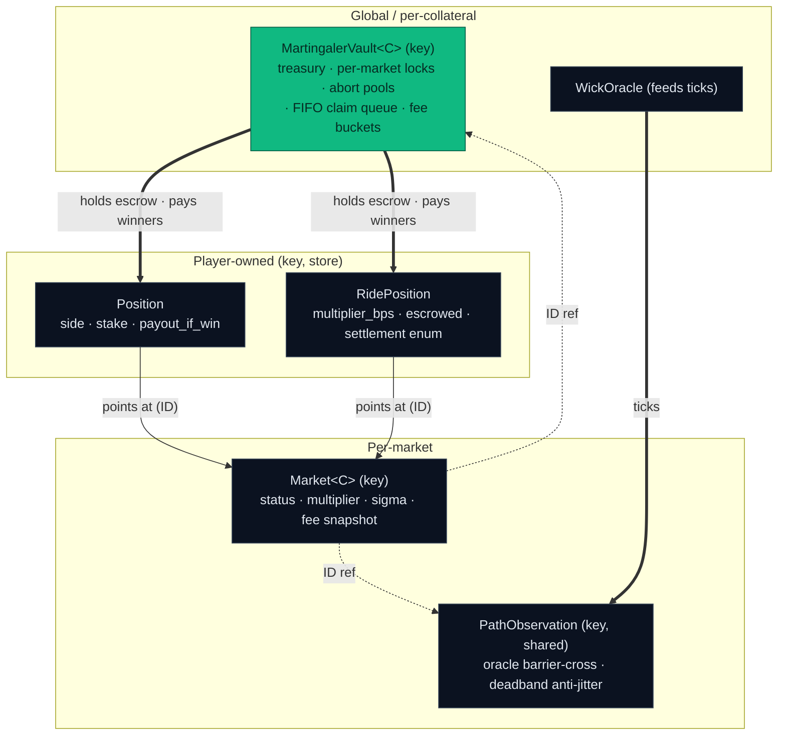

# Wick Markets — Contract Interface

The **judge- and frontend-facing seam** for the Wick Move package
(`move/sources/`). Generated from the real code (`wick.move` facade +
`AGENTS.md`/`docs/architecture.md` as the architectural source of truth). The
frontend and keeper call the entry functions and read the events defined here.

> Addresses change on redeploy — always read `deployments/testnet.json` from
> disk as the runtime source of truth. The IDs below are a snapshot.

## What Wick is

Short-dated, oracle-observed **barrier options on Sui**:

- **Touch / No-Touch** — does the underlying *wick* into a barrier before expiry?
  `TOUCH` wins on a hit; `NO_TOUCH` wins if the barrier is never touched.
- **Double-No-Touch (DNT)** — a corridor: wins if price stays between two
  barriers (`STATUS_DNT_HELD`), loses if either is broken (`STATUS_DNT_BROKEN`).
- **Ride** — a streaming-touch primitive that lives only while you hold the
  screen: stake accrues per-second; a barrier touch wins, cash-out or expiry
  ends it. The **live demo arcade** is the always-open **segment-market v4**
  ride: touch *either* barrier, cranked segment-by-segment, with an optional
  `enable_rug` house edge (v4.26).

Counterparty is the **MartingalerVault** (a loss-recycling LP vault), not a
peer pool. "Touch" means **the oracle's** buffered + deadbanded observation
crossed the barrier — not any off-chain tick.

## Deployed (Sui testnet) — snapshot of `deployments/testnet.json`

| | |
|---|---|
| Package | `0x1fdf784743d82c000e84154506e21daedc45bf241818fef6b28635e99e815924` |
| Publisher | `0xfad710377f820b10097f7ac445bc56e738db2bce712f898072061e0591049455` |
| Vault (SUI) | `0x73d3a17ab1e1cdc173b8cde1ae7d9789a29d1a177ebfd415196a04a6a10e5b9f` |
| Vault admin cap | `0x90245d7d154095c75dc07aa6d815d9b4df694d5a90c948a4be4f68914016b12c` |
| Coin type `C` | `0x2::sui::SUI` (markets/vault are generic over collateral `C`) |
| Clock | `0x6` |

Two market families in `testnet.json`:

- `segment_markets[]` — the **live v4 segment-market arcade** (added in the
  2026-05-24 upgrade; v4.26 adds the rug edge). This is the **active demo
  path** — a recently-traded market is
  `0x54e915308c596981fa94e5ff1f6f4e602e8bd1aae8c4a610cb782573310b5282`
  (`home_price 1e9`, `round_duration_segments 75`, `open_window_segments 13`).
  The `wick::sponsor` module is also live.
- `arcade_markets[]` — discrete random-walk touch markets (`market` / `oracle` /
  `path` / `random_walk` IDs), e.g. `WICK-RNG-25/100/1000`.

Always read `deployments/testnet.json` for the current set.

## Object model (see `docs/architecture.md` for full structs)

Sui-native by design: **no `Coin<T>` per market**. `key`-only `Market` objects
reference a single shared `MartingalerVault` by `ID`, and player positions are
owned NFTs — so the vault is the one counterparty and markets stay cheap to spin up.



- `Market<phantom C>` (`key`) — supply totals, status, payout multiplier, sigma,
  fee snapshot; references its `MartingalerVault` + `PathObservation` by `ID`.
- `Position` (`key, store`) — `side`, `stake`, `payout_if_win`, `pwe_at_open`;
  consumed on redeem (so a winner can't double-pay).
- `RidePosition` (`key, store`) — streaming touch; `multiplier_bps`,
  `stake_rate_micro_usd_per_sec`, `escrowed`, settlement enum
  (`OPEN / TOUCH_WIN / CASHOUT / EXPIRED_LOSS / ABORTED_REFUND`).
- `PathObservation` (`key`, shared) — oracle barrier-cross record with
  `buffer_bps` + `deadband_bps` anti-jitter; `new`/`new_dnt*` constructors.
- `MartingalerVault<C>` (`key`) — treasury, side buckets, per-market settlement
  locks + abort pools, FIFO claim queue, fee buckets.
- `RiskConfig`, `FeeRouter<C>`, `GlobalExposureRegistry`, `BotRegistry`,
  `WickOracle`, `UsdPriceOracle`, `RideMarketCaps`, `WickTokenState`,
  `WickStakingPool` — global/per-collateral support objects.

## Lifecycle

```
bootstrap_vault → seed_vault                       // once per collateral C
bootstrap_random_walk_market | bootstrap_pull_market   // per market
  → open_touch / open_no_touch  (stake → Position)     // many traders
  → (keeper ticks the oracle into PathObservation)
  → lock_and_settle             (permissionless, atomic)
  → redeem                      (winner burns Position; vault pays)
Rides (legacy):   open_ride → (close_ride | crank_expired_ride)
Live arcade (v4): bootstrap_segment_market_v4 → open_segment_ride_v4
                  → record_segment_v4   (permissionless crank, advances segments)
                  → (close_segment_ride_v4 | crank_expired_segment_ride_v4 | abort_segment_ride_v4)
```

## Entry functions — `wick::wick` facade (exact signatures)

```move
// --- vault (admin bootstrap) ---
public entry fun bootstrap_vault<C>(ctx)                       // → VaultAdminCap to sender
public entry fun seed_vault<C>(vault: &mut MartingalerVault<C>, seed: Coin<C>, clock, ctx)

// --- market creation (admin) ---
public entry fun bootstrap_random_walk_market<C>(             // synthetic-RNG arcade market
  name, underlying, starting_price, vol_bps, barrier, direction, expiry_ms,
  settlement_freshness_ms, payout_multiplier_bps, correlation_bucket_id,
  vault_side, vault: &MartingalerVault<C>, clock, ctx)
public entry fun bootstrap_pull_market<C>(                    // keeper-fed (BTC/ETH/SUI/SP500)
  name, underlying, upstream_id, keeper_cap: &KeeperCap, barrier, direction,
  expiry_ms, settlement_freshness_ms, payout_multiplier_bps, correlation_bucket_id,
  vault_side, vault: &MartingalerVault<C>, ctx)

// --- trade ---
public fun open_touch<C>(market, vault, risk_config, registry, bot_registry,
  path, stake: Coin<C>, spot, clock, ctx): Position           // side = TOUCH
public fun open_no_touch<C>(/* same args */): Position         // side = NO_TOUCH
public fun redeem<C>(market, vault, risk_config, fee_router, wick_state,
  staking_pool, price_oracle, position: Position, clock, ctx): Coin<C>

// --- settle (permissionless, atomic snapshot + status + lock release) ---
public fun lock_and_settle<C>(market, vault, path, oracle, registry, clock, ctx)
public fun recover_aborted_seed<C>(cap: &VaultAdminCap, vault, market)  // admin anti-rug

// --- ride (streaming touch) ---
public fun open_ride<C>(caps: &mut RideMarketCaps, path, vault, bot_registry,
  rate_micro_usd_per_sec, escrow: Coin<C>, clock, ctx): RidePosition
public fun close_ride<C>(ride, caps, path, oracle, vault, price_oracle,
  token_state, staking_pool, clock, ctx): Coin<C>
public fun crank_expired_ride<C>(ride, caps, path, vault, price_oracle,
  token_state, staking_pool, clock, ctx): Coin<C>
```

Sides: `market::side_touch()`, `market::side_no_touch()` (=1),
`market::vault_side_none()` (=255, allow both sides). `direction` selects which
crossing of `barrier` counts as a touch.

### Segment-market arcade v4 — the live demo path

The always-open, **touch-either-barrier** streaming arcade (deployed in the
2026-05-24 upgrade; v4.26 adds an opt-in rug house edge). It's cranked
permissionlessly segment-by-segment and is what the live demo trades.

```move
public entry fun bootstrap_segment_market_v4<C>(home_price, vol_regime_init,
  round_duration_segments, barrier_offset_bps, multiplier_bps, max_payout_per_round,
  deadband_bps, sigma_bps_per_sqrt_sec, cashout_spread_bps, abort_segment_deadline_ms,
  min_stake_per_segment, max_stake_per_segment, max_concurrent_rides,
  max_rides_per_user, vault, clock, ctx)
public entry fun record_segment_v4<C>(market, r: &Random, clock, ctx)  // permissionless cranker
public entry fun enable_rug<C>(market, rug_chance_bps)                 // v4.26 house edge (opt-in)
public fun open_segment_ride_v4<C>(market, vault, bot_registry,
  stake_per_segment, escrow: Coin<C>, clock, ctx): SegmentRidePositionV4  // touch EITHER barrier
public fun close_segment_ride_v4<C>(ride, market, vault, price_oracle,
  token_state, staking_pool, clock, ctx): Coin<C>                      // cash out
public fun crank_expired_segment_ride_v4<C>(/* same tail */): Coin<C>  // settle expired
public fun abort_segment_ride_v4<C>(ride, market, vault, clock, ctx): Coin<C>  // 1:1 refund
```

**Roadmap (not in the live demo path):** `segment_market_v3` (stashed to
`move/sources-stash/`); the off-chain sponsored-cranking service
(`harvest_to_sponsor`); and the Walrus archive + storage-rebate pruning
(`record_walrus_archive_v4` / `prune_settled_segments_v4`).

## Events (subscribe for the live feed / `/verify`)

Discrete / legacy: `MarketCreated`, `PositionOpened`, `BarrierTouched`,
`OracleSettled`, `MarketSettled`, `PositionRedeemed`, `RideOpened`, `RideClosed`,
`LockInitialized`, `PathSettlementLocked`, `SettlementLockReserved`,
`SettlementLockReleased`, `AbortRefundPoolFunded`, `AbortRefundClaimed`,
`SegmentMarketCreated`.

Live **v4 arcade**: `SegmentMarketV4Created`, `RoundStartedV4`,
`SegmentRecordedV4`, `RideOpenedV4`, `RideClosedV4`, `RugFiredV4` (+
`RoundArchivedV4` / `SegmentsPrunedV4` for the archive/prune roadmap). All
events are `copy, drop`.

## Settlement & payout

- A `Position` fixes `payout_if_win` at open (from the market's
  `payout_multiplier_bps` and the probability-weighted entry `pwe_at_open`). On
  settle the winning side redeems `payout_if_win`; the losing side gets nothing.
  The **MartingalerVault** is the counterparty and absorbs the PnL.
- Status is mutually exclusive — touch settles `HIT` xor `EXPIRED`; DNT settles
  `DNT_HELD` (5) xor `DNT_BROKEN` (6). Settlement is **atomic + idempotent**.
- Fees route via `FeeRouter` into protocol / staker / insurance buckets; the DNT
  path adds an asymmetric **impact fee** (`decisiveness_bps_for_side`).
- **Aborted** markets refund depositors **1:1** (never 2:1); admin can recover
  only stranded seed back to the vault treasury.

## Safety invariants (load-bearing — enforced + tested)

- **Collateral invariant** (vault conservation), after every transition:
  `cumulative_in − cumulative_out == held` (held = treasury + side_bucket + Σ per-market locks)
  (test: `conservation_in_minus_out_equals_held` in `move/tests/martingaler_vault_tests.move`;
  full property→test map in [`move/SAFETY.md`](move/SAFETY.md)). The older
  `collateral_vault == total_touch_supply == total_no_touch_supply` phrasing is a
  retired-v1 (complete-set) artifact. Violations are direct loss-of-funds.
- A market cannot settle both ways; settlement is idempotent; redeem consumes the
  `Position` UID so it can't double-pay; the losing side cannot redeem;
  `lock_and_settle` commits snapshot + status + fee + lock-release atomically.
- Rides: touch wins ties at the `close_ride` boundary; aborted refund is 1:1.

## Build / test

```bash
cd move && sui move test            # the invariant + DNT + probability suites
./scripts/agent-preflight.sh        # gate: sui move test + frontend/keeper tsc --noEmit
```

The deployed package corresponds to this source. Demo is **testnet only**.
