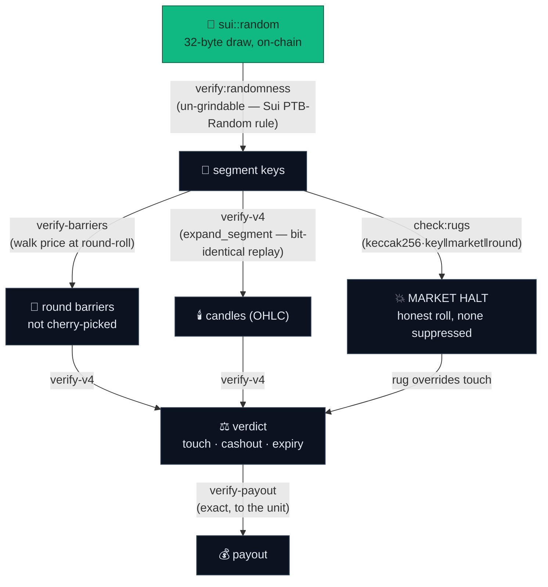

# Provable fairness — the house chooses nothing

Every number a player sees — the barriers, the candles, the halt, the verdict,
and the money — is **derived** from a value the house can't pick: a
`sui::random` 32-byte draw committed on-chain inside `record_segment`. Nothing
in the chain below is an input the operator controls; each box is a pure
function of the box(es) before it, and each arrow has a **named verifier you can
run yourself** with no wallet and no indexer.



The operator picks **none** of it: not the keys, not the barriers, not the
candles, not the halt, not the verdict, not the money. And the rules can't move
after you bet — the multiplier, rug chance, barrier offset, deadband, and spread
are set once at market bootstrap with **no on-chain setter** (the only
rug-chance mutator is `#[test_only]`, compiled out of the published package).

## Run the whole chain yourself

One command proves all of it for any real ride — no wallet, no indexer:

```bash
npm run audit:ride -- --market <SegmentMarketV4 id> --ride <ride id>
#   → re-derives barriers · candles · MARKET HALT · verdict · payout
#   → ✅ COMPLETE AUDIT PASS  (passes only if all five hold)
```

Don't trust a cherry-picked example — **pick your own ride:**

```bash
npm run rides:recent   # lists real recent rides (a touch win, a cashout, a HALT)
                       # each with a paste-ready audit command
```

Narrower proofs, each mapping to one arrow above:

| Arrow | Command | Proves |
|---|---|---|
| random → keys | `npm run verify:randomness` | the keys come from `sui::random`, un-grindable |
| keys → candles | `npm run verify:fairness` · `…:tamper` | candles replay bit-for-bit; a tampered candle is caught |
| keys → HALT | `npm run verify:halt` · `npm run check:rugs` | the freeze was an honest keccak roll; none suppressed |
| verdict → payout | `npm run verify:payout -- --market <id> --ride <id>` | the chain paid the exact right amount |
| (in your browser) | [/verify](https://wick-markets.vercel.app/verify) | replay any ride live; toggle "dishonest house" to watch it get caught |

## Why it's airtight

- **Un-grindable randomness.** The draw is gated by Sui's PTB-Random structural
  rule — the validator rejects any PTB that places attacker code after a
  `Random`-consuming MoveCall, so the classic "test-and-abort grinder" can't
  work. (See [`docs/design/v2/17a_sui_randomness_spike.md`](design/v2/17a_sui_randomness_spike.md).)
- **Bit-identical replay.** `seeded_path::expand_segment` (the Move candle
  generator) has a byte-for-byte TypeScript port (`sdk/src/seededPath.ts`);
  10k random vectors are checked via a rolling blake2b digest in CI on every commit.
- **Prune-proof.** The verifiers read the on-chain segment table directly, so
  they work even after storage is reclaimed — and a round can't be pruned while
  any ride in it is still unsettled (see [`move/SAFETY.md`](../move/SAFETY.md)).

The candles, the house edge, the verdict, **and the money** are each a function
call you can run. If a candle in your loss looks wrong — replay it.
